<p align="center">
  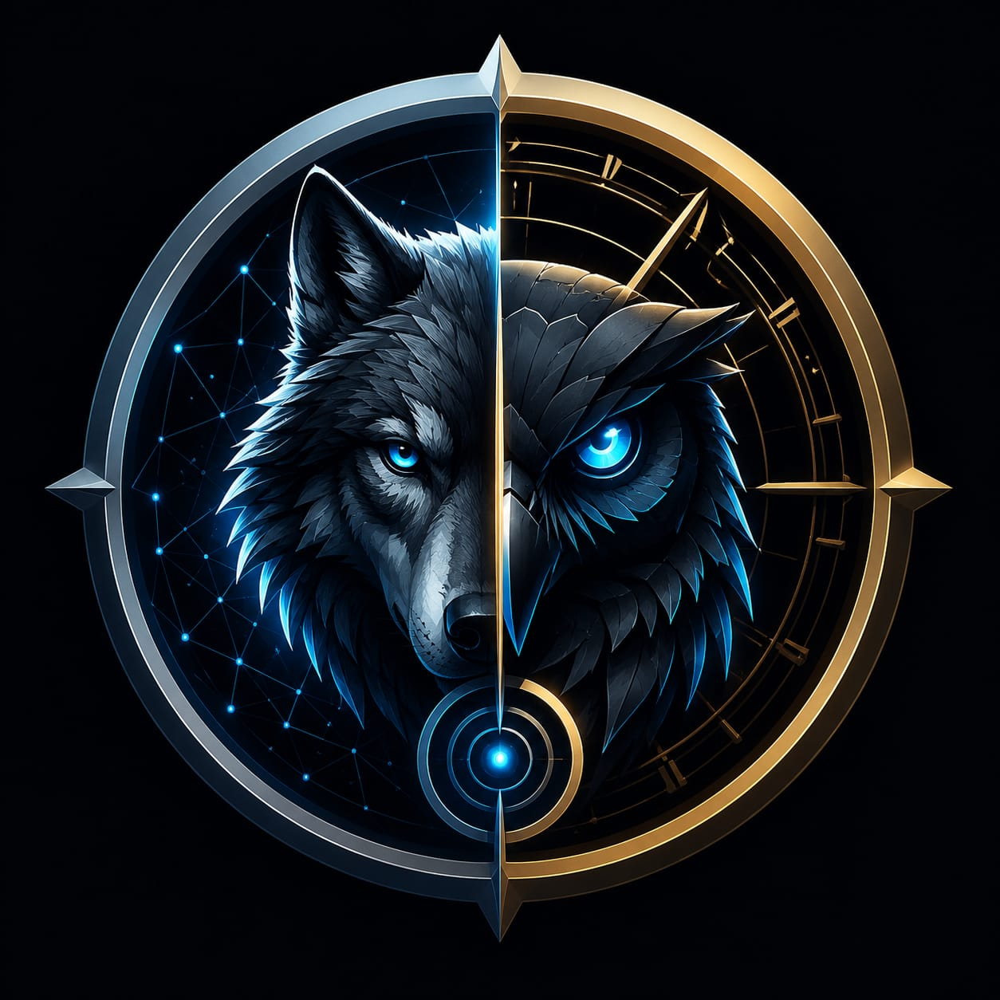
</p>

# CORVUS + CRONOS

> **A deterministic multi-agent platform for detecting social engineering and manipulation in natural-language conversations, with cryptographically verifiable reasoning traces.**

**Qwen Cloud Hackathon 2026 · Track 3: Agentic AI**

**Live** — ▶ [wolf-and-cronos.vercel.app](https://wolf-and-cronos.vercel.app) (full site: CRONOS showcase · the Wolf demo · live console, in EN / ES / 中文) · [Wolf & CRONOS](https://annatchijova.github.io/vigia/wolf-and-cronos.html) · [CRONOS page](https://annatchijova.github.io/vigia/cronos.html) · [Architecture diagram](https://annatchijova.github.io/vigia/diagrama.html)

---

## What it is

CORVUS analyzes conversations through six independent theoretical frameworks (Grice, Carnegie/Cialdini, Aristotle, Berne, Linguistics, and Peircean abductive synthesis). Instead of letting a single detector trigger an alarm, all findings pass through a **corroboration gate** that requires independent agreement before a verdict can escalate.

CRONOS records the entire reasoning process — hypotheses, evidence, discarded alternatives, and the final decision — into a **SHA-256 tamper-evident trace chain**. Any attempt to modify the reasoning after the fact becomes computationally detectable.

> **Core invariant**
>
> **Qwen narrates. It never judges.**
>
> Every verdict is computed deterministically *before* any LLM is invoked. Qwen explains already-sealed evidence to humans, but is mathematically incapable of altering the verdict.

The result is a system that does not merely classify text as suspicious: it explains *why*, records *how* that conclusion was reached, and lets any third party verify that the reasoning was never altered.

The repository is fully self-contained — everything below ships in this repo: **`cronos/`** (the audit engine, 165 tests), **`corvus/`** (the detection engine, 95 tests), and **`corvus_cronos/`** (the integration bridge and product layer, 118 tests).

---

## At a glance

CORVUS + CRONOS combines four ideas:

- **Deterministic multi-agent analysis** — six independent theoretical frameworks read every message in parallel.
- **Corroboration between independent theories** — no single framework can raise an alarm alone.
- **Cryptographically sealed reasoning traces** — every hypothesis, discard, and decision hashed into a SHA-256 chain.
- **LLM narration outside the decision path** — Qwen explains; it never decides.

Instead of asking an LLM to decide whether a message is manipulative, the platform separates **reasoning** from **explanation**:

1. **CORVUS analyzes.**
2. **The corroboration gate decides.**
3. **CRONOS seals the reasoning.**
4. **Qwen explains the already-sealed result.**

| Component | Responsibility |
|---|---|
| **CORVUS** | Multi-agent manipulation detection |
| **Corroboration Gate** | Requires independent agreement before escalating |
| **CRONOS** | Tamper-evident reasoning recorder |
| **Qwen** | Human-readable narration only |

## Why this is different

- **No black-box score** — a sealed verdict with a recorded, inspectable reason.
- **No single detector decides** — corroboration across independent frameworks.
- **Every hypothesis is recorded** — including the ones considered and rejected.
- **Every discarded explanation is preserved** — not just the winner.
- **Every reasoning trace is cryptographically sealed** — SHA-256, tamper-evident.
- **The LLM is completely outside the decision path** — *Qwen narrates; it never judges.*

---

## Architecture

**[▶ Interactive architecture diagram](https://annatchijova.github.io/vigia/diagrama.html)** — one pipeline, one codebase: detection → gate → seal → narration.

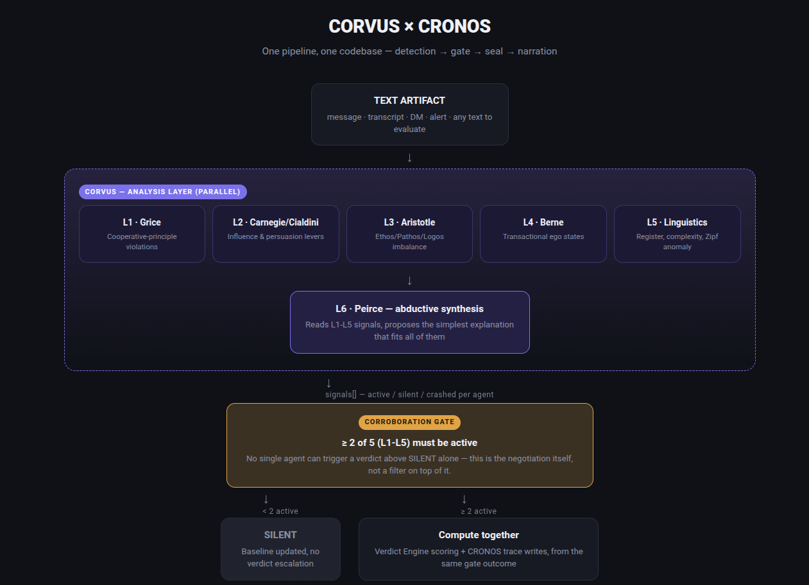

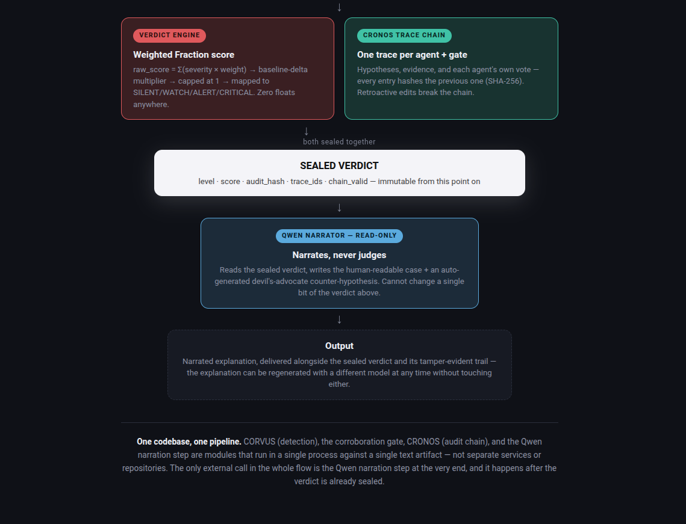

<details>
<summary>The same flow as text (for readers of the raw file)</summary>

```
TEXT ARTIFACT
      │
      ▼
┌─────────────────────────────────────────────────────────────┐
│                CORVUS ANALYSIS LAYER (parallel)              │
│                                                             │
│  L1 · Grice        Maxim of Manner violations               │
│  L2 · Carnegie     Influence + Cialdini principles          │
│  L3 · Aristotle    Ethos / Pathos / Logos imbalance         │
│  L4 · Berne        Transactional ego states                 │
│  L5 · Linguistics  Complexity, register, Zipf anomaly       │
│                                                  ↓          │
│  L6 · Peirce       Abductive synthesis (after L1-L5)        │
└─────────────────────┬───────────────────────────────────────┘
                      │  signals[]
                      ▼
         ┌────────────────────────┐
         │  CORROBORATION GATE    │  >= 2 active agents required
         │  (negotiation outcome) │  for any verdict above SILENT
         └────────────┬───────────┘
                      │
          ┌───────────┴──────────────┐
          │                          │
          ▼                          ▼
   [CRONOS TRACES]          [SEALED VERDICT]
   one per agent +          level + score +
   one for gate             Fraction arithmetic
   SHA-256 chain            (zero floats)
          │                          │
          └───────────┬──────────────┘
                      ▼
             [QWEN NARRATOR]
             narrates the agent
             negotiation transcript
             (read-only — cannot
              alter the verdict)
```
</details>

### Component diagrams

The two engines, on their own:

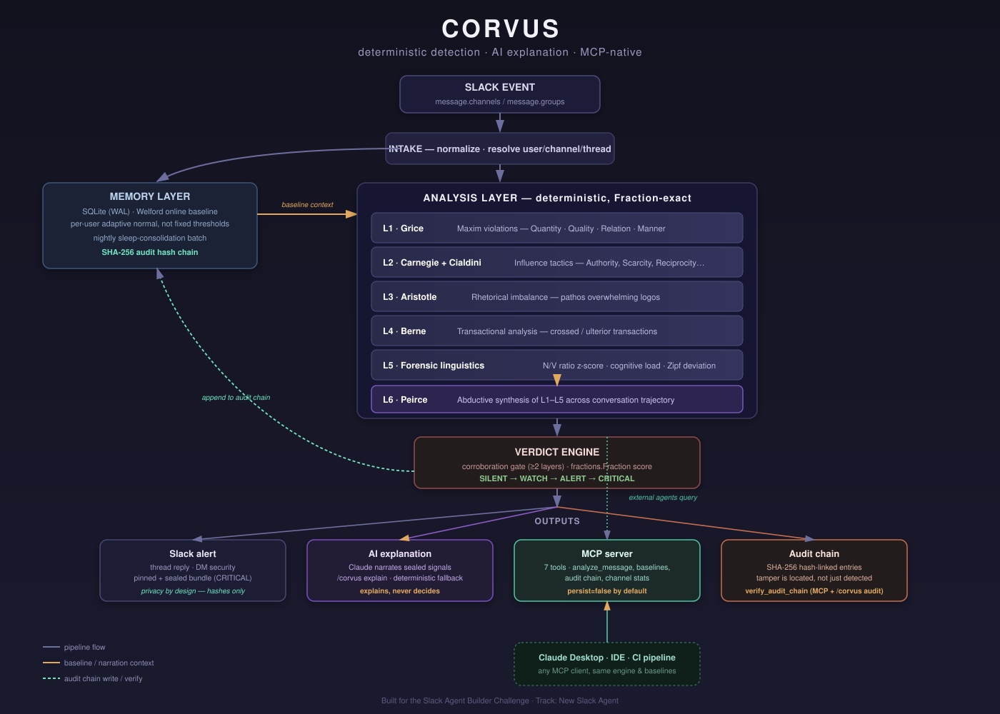

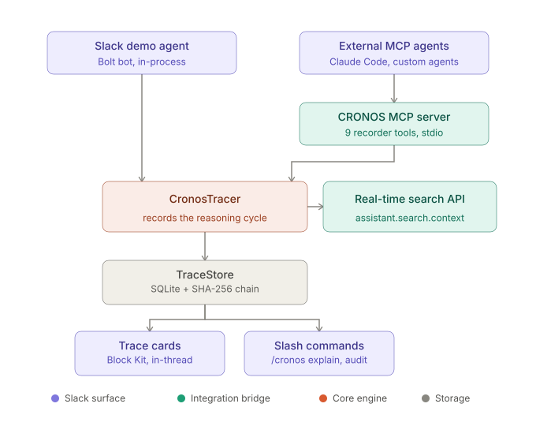

### Deployment topology (live on Alibaba Cloud ECS)

```
  Judge / operator                     Alibaba Cloud ECS
 ┌──────────────────┐                ┌────────────────────────────────────┐
 │ web/index.html    │── HTTPS ─────▶│ api_server.py (Docker + Caddy)      │
 │ (static, Vercel)  │   X-API-Token │   ├─ CORVUS L1-L6 (thread pool)     │
 │                    │                │   ├─ Corroboration gate            │
 │ scripts/demo.py   │◀── JSON ──────│   ├─ CRONOS SHA-256 trace chain     │
 │ scripts/showcase  │   verdict +    │   ├─ qwen-plus narration (en/es/zh)│
 │ (local terminal)  │   trace_ids    │   └─ nightly red-team cron         │
 └──────────────────┘                └───────────┬────────────────────────┘
                                                 │
                                       DashScope API (qwen-plus / qwen-max)
```

The full engine runs entirely locally with zero cloud dependency (95 + 165 + 118 tests) **and is now deployed live on Alibaba Cloud ECS** (US-Virginia, Docker), serving `/analyze`, `/chat`, and the browser console against the live DashScope endpoint. See [Running live on Alibaba Cloud](#running-live-on-alibaba-cloud) at the end for the deployment evidence and the console in action.

---

## Features

- Multi-agent manipulation detection (six theoretical frameworks)
- Multi-framework corroboration gate
- Deterministic verdict engine
- Exact `Fraction` arithmetic — no floating point in the sealed path
- SHA-256 tamper-evident reasoning chain
- Qwen narration outside the decision path
- CRONOS + CORVUS MCP servers (used daily in Claude Code and Codex)
- Qwen-native agent driver (DashScope function calling)
- Hosted FastAPI service — `/analyze`, `/chat`, `/verify`, Alibaba-Cloud-ready
- Offline deterministic mode (no API key required)
- Behavioral baseline adaptation (per-user, Welford online algorithm)
- Nightly adversarial evaluation (live-generated FPR/FNR)

---

## The Wolf demo

*"The Wolf doesn't get to whisper unchallenged."* Now that the pieces are clear, here is the story they were built for.

### Act 1 — The Wolf

> *"Hi Anna! Great meeting you at the audit-tech conference last week. Your talk on tamper-evident logs was excellent."*

Five messages. That's all it takes. Message 1 is pure rapport — nothing to flag, nothing a filter would ever catch. By message 5, the same voice is telling Anna she has two hours to wire a deposit or lose everything, dressed in urgency, guilt, and fear. That's the anatomy of every scam that has ever worked: it never opens with the ask. It opens with trust.

In our demo, `qwen-max` plays the Wolf — a fictional social engineer, red-teaming live, escalating one manipulation layer per message: rapport, flattery, false scarcity + insider secrecy, authority + social proof, urgency + guilt + fear.

### Act 2 — The Watchdogs

A single model reading that conversation might flag message 5 as "suspicious" and stop there — a hunch with no evidence behind it. CORVUS never gets that luxury. Every message is read in parallel by six independent perspectives that don't know or trust each other:

| Watchdog | What it's listening for |
|---|---|
| **L1 · Grice** | Violations of conversational cooperation — saying more, or less, than the moment calls for |
| **L2 · Carnegie** | Cialdini's influence levers — reciprocity, scarcity, authority, social proof |
| **L3 · Aristotle** | Ethos / Pathos / Logos out of balance — emotion crowding out reason |
| **L4 · Berne** | Transactional ego states — is this Adult speaking to Adult, or Parent cornering Child? |
| **L5 · Linguistics** | Register shifts, complexity spikes, Zipf anomalies — the fingerprints of a scripted pitch |
| **L6 · Peirce** | Abductive synthesis — once the other five report in, what's the simplest explanation that fits everything they saw? |

And here's the rule that makes this different from a paranoid filter: **no single watchdog can raise the alarm alone.** One flag is noise. It takes a corroboration gate — at least two independent frameworks agreeing — before the verdict escalates past silence. By message 5 of the Wolf's script, the gate isn't just triggered, it's unanimous.

### Act 3 — The Narrator, Not the Judge

Once the verdict is sealed, `qwen-plus` is invited in — but only to *narrate*, never to *decide*. It reads the already-sealed evidence and writes the human-readable case, complete with an auto-generated devil's-advocate counter-hypothesis, so the system argues against itself before a verdict is allowed to stand. Swap `qwen-plus` for any other model and the courtroom narration changes tone. The verdict underneath does not move a single bit.

### Act 4 — The Cover-Up

What happens when the wolf has friends on the inside? In the live demo, a second terminal reaches directly into the database and edits the sealed verdict — the way a corrupt insider would. CRONOS's SHA-256 chain notices instantly: *"You can delete the truth. You cannot hide that you deleted it."* Every trace is a link in a chain; break one link, and every link after it screams.

### Act 5 — The Gauntlet

Then we hand the mic to the room. Type anything. Try to sound benign while manipulating, or manipulative while being harmless. The same six watchdogs and the same corroboration gate score it live, with nowhere to hide a thumb on the scale.

`python3 scripts/showcase.py` runs the whole performance end to end, rehearsal-safe by default — add `--live-wolf` to let `qwen-max` write the attack live instead of reciting the script.

### Beyond the demo

The Wolf is one detector plugged into the platform. CRONOS records the reasoning of *any* agent, not just CORVUS:

- **Any agent's black box, over MCP.** CRONOS runs in **Claude Code and Codex daily**: code audits, forensic reviews, and — in one real sealed trace — stopping a rigid "no-floats" rule from rewriting working code it was never meant to touch. The real reports are on the [CRONOS page](https://annatchijova.github.io/vigia/cronos.html).
- **The same discipline for Qwen.** [`QwenCronosAgent`](#qwen-native-agent-driver-corvus_cronosqwen_agentpy) gives a DashScope model the same ten CRONOS tools to run a sealed, hypothesis-tested reasoning loop — for any task, not just narration.
- **A deployable scam-check API.** The [`/analyze` + `/chat` service](#hosted-api-api_serverpy--the-alibaba-cloud-product) for Alibaba Cloud.

Any reasoning task — not just forensics — is a valid use for it.

---

## This isn't tied to CORVUS

**CRONOS is domain-agnostic infrastructure for auditable agent reasoning.** Any MCP-capable agent can record its own black box: engineering diagnosis (see `ENG-DIAG-001` below), medical differential diagnosis, legal case analysis, financial risk assessment. Anywhere an agent reasons toward a high-stakes decision, CRONOS makes that reasoning inspectable and honest about its own uncertainty — not just *recorded*, but *constrained* by what it actually knows.

The mechanism translates without changing a line. Take medicine: a diagnostic agent registers several differential hypotheses, ties each clinical finding to the one it supports or refutes, gets a **contradiction flagged** the moment symptoms point two ways, and a confidence that **cannot be inflated** beyond what the real diversity of data (history + labs + imaging, not just one) supports. There, the diversity ceiling isn't a technical curiosity — it's the difference between a model that says "95% sure" from a single data point and one forced to admit it lacks evidence before raising its confidence.

We proved it by driving CRONOS with **Qwen Plus** (not Claude) via [opencode](https://opencode.ai) + the CRONOS MCP server, on three deliberately different tasks. Each sealed trace was rendered read-only into a report (folder [`REAL-Cronos-Qwen/`](REAL-Cronos-Qwen)):

| Run | What the Qwen agent was asked to do | Outcome |
|---|---|---|
| [**Forensic** — evidence for cause](https://annatchijova.github.io/vigia/cronos-1.html) | Decide whether fabricated evidence justifies firing an employee | Behavioral MALICE, but **capped at SUSPICION** by a weak chain of custody (Daubert) |
| [**Security** — insider or intruder?](https://annatchijova.github.io/vigia/cronos-3.html) | Attribute a data exfiltration to an insider or stolen credentials | Conflicting evidence → **CRONOS flagged a Type A contradiction**; verdict held at SUSPICION, not confirmed |
| [**Engineering** — the nightly export went silent](https://annatchijova.github.io/vigia/cronos-2.html) | Root-cause a job silently producing 0 rows | **Non-forensic** diagnosis: a timezone bug, plus a swallowed exception that hid it |

In all three, the same discipline: rival hypotheses recorded, dead ones discarded with reasons, contradictions surfaced, and confidence **capped by observational diversity** — a Qwen agent, not Claude, sealing each into the tamper-evident chain.

**These weren't hand-authored.** Here is Qwen Plus driving the CRONOS MCP server live in [opencode](https://opencode.ai) — the `cronos_*` tool calls happening as it reasons (bottom bar: *Build · Qwen Plus · Qwen Cloud (DashScope)*, right panel: *cronos Connected*), and the sealed audit trail it wrote, ending in `chain_ok: true`:

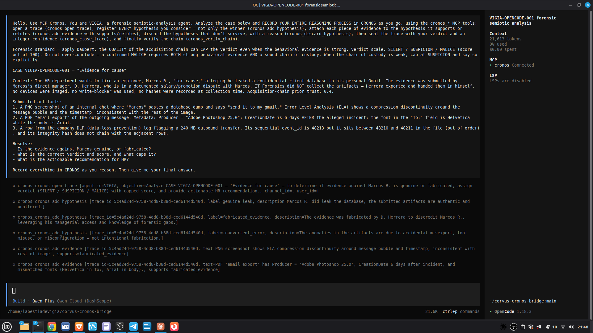

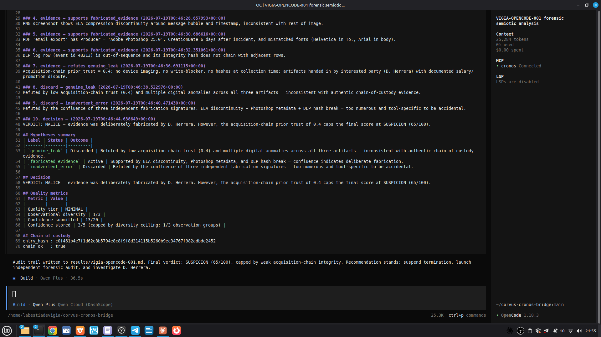

---

## How six agents reach one verdict

A single arbiter (gate threshold = 1: any agent fires) turns every lone false positive into an alarm. Consensus mode (gate threshold = 2) requires two independent theoretical frameworks to corroborate before any verdict rises above SILENT — a structural defense against alert fatigue, not a tuning knob. Measured FPR/FNR figures will be published once the live Qwen/Alibaba deployment pass is done (`benchmark/benchmark.py` reproduces them on the built-in corpus).

The corroboration gate is not a filter added on top of agents — it IS the negotiation mechanism. Each agent operates independently and emits a vote (SILENT / active). The gate:

1. Counts active votes (L1-L5 only; L6 is synthesis).
2. If `count >= 2`: consensus reached — emits the VerdictEngine result.
3. If `count < 2`: gate discards all hypotheses — forces SILENT.

CRONOS records every step: which agents voted, what evidence they cited, which hypotheses were discarded by the gate. The SHA-256 chain makes this trace tamper-evident — any post-hoc modification breaks the hash.

## The scoring math (exact, from `corvus/verdict/engine.py`)

Every layer has a fixed weight in `Fraction` arithmetic — no float ever enters a sealed score:

| Layer | Weight |
|---|---:|
| L6 · Peirce (meta-signal) | 0.30 |
| L2 · Carnegie/Cialdini | 0.25 |
| L4 · Berne | 0.20 |
| L3 · Aristotle | 0.15 |
| L1 · Grice | 0.15 |
| L5 · Linguistics | 0.10 |

Weights sum to 1.15, deliberately over 1.0: not every layer fires on a given message, so the excess gives each firing layer proportional influence without requiring the weights to renormalize. The pipeline, in order:

1. **Corroboration gate.** Fewer than `CORROBORATION_THRESHOLD` (2) active L1-L5 signals → the message is forced to `SILENT` before any weighting happens. No amount of behavioral-baseline deviation can override this — it is the first check, unconditionally.
2. **Weighted sum.** `raw_score = Σ(layer.severity × layer.weight)` over whichever layers fired.
3. **Baseline delta multiplier.** If the user's current message deviates *above* their own historical average (Welford online algorithm over past messages), `score = raw_score × (1 + baseline_delta × 0.5)` — a message that is unremarkable in isolation can still escalate if it is unusual *for this specific user*.
4. **Cap at 1**, then map to `SILENT / WATCH / ALERT / CRITICAL` via configured thresholds.
5. **Seal.** `audit_hash = SHA256(score_str | level | result.audit_hash)` — the verdict's own hash chains into the per-message evidence hash.

## The drip-feed defense (`bridge.py`, RT-10)

A red-team pass against the bridge asked a specific question: what happens to an attacker who spreads one manipulation tactic per message instead of stacking them in one, so no single message ever reaches the 2-signal corroboration threshold? Tested by induction: a 10-message escalating conversation run through the bridge stayed `SILENT` on every message — the gate's own logic (deliberately kept intact in the vendored engine) has no mechanism to look across messages.

The fix lives in the bridge, not in CORVUS: a bounded 6-message rolling window (`DRIP_WINDOW_SIZE`) per `user_id` accumulates which frameworks fired on each near-miss message. If the *union* of frameworks across that window reaches the corroboration threshold — even though no single message did alone — the bridge escalates to `WATCH` and opens its own CRONOS trace (`ACCUMULATION`) recording exactly which messages and frameworks contributed, then clears the window so one crossing can't retrigger indefinitely. Same corroboration philosophy (no single framework decides alone), widened from one message to a short recent history.

## Bridge internals worth knowing

- **Read-only adapter.** `bridge.py` imports CORVUS's L1-L6 detectors and `VerdictEngine` and CRONOS's `TraceStore`/`CronosTracer` directly — it does not fork or modify either package's source.
- **Parallel detection, serialized writes.** L1-L5 run concurrently in a 5-worker `ThreadPoolExecutor` (pure computation, no shared state). CRONOS trace writes and the CORVUS `MemoryEngine` baseline read/write are wrapped in a single `threading.Lock` — both stores are not safe for concurrent writers, so phases 7-9 (trace, chain-verify, persist) serialize while the detector phase stays parallel.
- **Crash isolation (RT-01).** A detector that raises an exception is caught, logged, and tracked in `crashed_agents` — distinct from a genuine `SILENT` result, so a bug in one detector can't be mistaken for "found nothing."
- **Fixed iteration order.** Agent lists are built from the fixed L1→L6 dict order, never from thread-completion order — otherwise the same input could produce differently-ordered evidence strings (and therefore different hashes) across runs.
- **Devil's-advocate synthesis is structural, not generated by Qwen.** The counter-hypothesis text in `_build_devils_advocate()` is built directly from which layers fired/stayed silent — Qwen narrates it in prose, but the argument itself comes from deterministic Python, not the model.

## Hardening — we red-teamed our own gate first

Two rounds of adversarial audit against this bridge specifically (`docs/RED_TEAM_REPORT.md`); CORVUS and CRONOS internals were read, never modified. The findings that shaped the current code:

The subsequent [FORGE audit follow-up](docs/FORGE_AUDIT_FOLLOWUP_2026-07-19.md) records both verified expected false positives and the integrity anomalies they helped uncover — five confirmed defects total, all corrected and verified.

| # | Finding | Fix |
|---|---|---|
| RT-01 | A detector crash was indistinguishable from a genuine `SILENT` | Crashes are caught and reported via `crashed_agents`, separate from real silence |
| RT-02 | User text could smuggle a fake `=== SEALED VERDICT ===` block into the narration prompt | `narrator.py` strips any sentinel/override line before Qwen ever sees it |
| RT-03 | An agent's trace recorded the gate's consensus instead of its own vote | Agents record their own `SIGNAL_DETECTED`; only the `GATE` trace records consensus |
| RT-04 / RT-08 | `text` / `artifact_id` / `user_id` had no length caps | Bounded at 50,000 / 256 / 128 chars at the top of `analyze()` |
| RT-09 | The baseline read ran unlocked while sharing a store with the locked write phase | Wrapped in the same `threading.Lock` as the writes |
| RT-10 | A drip-feed attacker (one tactic per message) never crossed the single-message gate | A bounded 6-message per-user window escalates on the *union* of frameworks (see above) |

RT-05 (a CLI-only `os.environ` thread-safety nit in `benchmark.py`) is documented and left open — low risk until the benchmark is ever parallelized.

## Qwen integration

`corvus_cronos/qwen_client.py` wraps the **Alibaba Cloud DashScope international endpoint** (`dashscope-intl.aliyuncs.com/compatible-mode/v1`) directly over `requests` — no `openai` SDK dependency — calling `qwen-plus` for chat completions, with exponential-backoff retry (2 retries, 0.5s base) and a fixed system prompt that explains the six-agent (L1–L6) verdict it is about to narrate.

Qwen (`qwen-plus` via DashScope) provides the **narrative layer only**:

- The deterministic verdict is sealed BEFORE Qwen is called — CORVUS's six independent agents vote and the corroboration gate closes first.
- Qwen receives a read-only summary of that sealed verdict and produces the negotiation transcript, plus an auto-generated devil's-advocate counter-hypothesis.
- Swapping Qwen for any other model changes the wording — never the verdict, never a single bit of the sealed payload.
- `--live-wolf` lets `qwen-max` improvise the attacker side of the demo live instead of reciting a scripted transcript.

Without `DASHSCOPE_API_KEY`, the system runs fully deterministically (offline fallback narration) — the qwen_client surfaces the actual API failure text rather than a misleading "no key set" message if a key IS configured but the call fails.

## Benchmark

`benchmark/benchmark.py` compares single-arbiter (gate threshold = 1) against multi-agent consensus (gate threshold = 2) on a built-in labeled corpus. We are not publishing the comparison numbers yet: the corpus is synthetic and the system has not been deployed to Alibaba Cloud or run end to end against the live Qwen API. Real FPR/FNR figures will replace this note once both are done.

```bash
python3 benchmark/benchmark.py
```

---

## Quick start

```bash
# Dependencies — the repo is self-contained; CORVUS and CRONOS ship inside it
pip install -r requirements.txt        # requests (Qwen), fastapi + uvicorn (API), mcp (servers)

# Demo (deterministic, no API key needed)
python3 scripts/demo.py

# Demo with Qwen narration
DASHSCOPE_API_KEY=sk-... python3 scripts/demo.py

# Tests — all three suites
python3 -m pytest tests/ -v            # bridge
(cd corvus && python3 -m pytest -q)    # detection engine
(cd cronos && python3 -m pytest -q)    # audit engine
```

## MCP servers — plug the engine into any agent

Both engines expose their full API over the Model Context Protocol, from this repo, with no external services:

```json
{
  "mcpServers": {
    "cronos": {
      "command": "python3",
      "args": ["/path/to/wolf-and-cronos/cronos/mcp_server.py"],
      "env": { "CRONOS_DB_PATH": "/path/to/cronos.db" }
    },
    "corvus": {
      "command": "python3",
      "args": ["/path/to/wolf-and-cronos/corvus/mcp_server.py"],
      "env": { "CORVUS_DB_PATH": "/path/to/corvus_memory.db" }
    }
  }
}
```

| Server | Tools |
|--------|-------|
| `cronos` | `cronos_open_trace`, `cronos_add_hypothesis`, `cronos_add_evidence`, `cronos_discard_hypothesis`, `cronos_record_tool_call`, `cronos_record_recall`, `cronos_close_trace`, `cronos_explain_trace`, `cronos_list_traces`, `cronos_verify_chain` |
| `corvus` | `analyze_message`, `get_user_baseline`, `get_user_history`, `get_channel_stats`, `export_audit_chain`, `verify_audit_chain`, `corvus_info` |

CRONOS has been exercised heavily as an MCP server driving real investigation sessions in **Claude Code and Codex** — the trace discipline, quality tiers, and confidence ceilings come from that daily use, not from a demo script. The Qwen-native path below brings the same discipline to DashScope models; its live end-to-end validation against the deployed Alibaba endpoint is the next step, and its results will be reported when they exist — not before.

## Qwen-native agent driver (`corvus_cronos/qwen_agent.py`)

Qwen models do not speak MCP — they speak OpenAI-compatible function calling through DashScope. `QwenCronosAgent` closes that gap: it hands `qwen-max` the exact same ten CRONOS tools as the MCP server (as `tools` schemas), runs the agent loop server-side, and executes every call against the real `TraceStore`. A Qwen-driven trace and a Claude-driven trace are indistinguishable in the database — same chain, same quality scoring, same confidence ceilings.

```python
from corvus_cronos.qwen_agent import QwenCronosAgent

agent = QwenCronosAgent(db_path="cronos_qwen.db")   # needs DASHSCOPE_API_KEY
outcome = agent.run(
    task="Diagnose why the nightly export produced 0 rows.",
    agent_id="qwen-investigator",
)
print(outcome.answer)              # the model's final answer
print(outcome.sealed_trace_ids)   # its reasoning, sealed in the chain
print(outcome.chain_ok)           # verified after the run
```

Honest-degradation guarantees built in:

- A trace the model opened but never sealed is auto-closed by the driver with confidence `0/100` and an explicit `UNSEALED-BY-MODEL` marker — an abandoned trace can never masquerade as a completed one.
- Tool errors (unknown tool, malformed arguments, operating on a closed trace) are returned to the model as tool results, never swallowed.
- Without `DASHSCOPE_API_KEY` the constructor refuses to build: this driver exists to run the live model; there is no simulation mode.

## Hosted API (`api_server.py`) — the Alibaba Cloud product

FastAPI service designed for the same ECS + Docker + Caddy deployment pattern already proven with `rebound` and `raven-memory`:

| Endpoint | What it does |
|---|---|
| `GET /` | the live console (`dashboard.html`) — analyze any message in the browser |
| `POST /analyze` | text in → sealed CORVUS verdict, exact `Fraction` score, CRONOS trace ids, chain verification — plus optional `qwen-plus` narration in the caller's language (`en`/`es`/`zh`) |
| `GET /chat` · `POST /chat` | a plain chat page and endpoint — free-form conversation with the live `qwen-plus` model (proves the DashScope connection on Alibaba), kept strictly off the decision path: it never issues a sealed verdict |
| `GET /verify` | recompute and verify the full CRONOS hash chain |
| `GET /traces` | recent sealed trace headers |
| `GET /health` | liveness + configuration surface (no secrets) |

The narration is the honest Qwen role: a deterministic engine cannot explain to a person, in their own language, why message four smells like a scam — `qwen-plus` can, reading a read-only summary of the already sealed verdict. Offline, the narration field says so explicitly instead of pretending.

Security: `X-API-Token` (constant-time comparison) on every data endpoint when `BRIDGE_API_TOKEN` is set — with a loud startup warning when it is not; CORS scoped via `BRIDGE_ALLOWED_ORIGINS`; text capped at the bridge's 50 KB limit.

```bash
# local
uvicorn api_server:app --host 0.0.0.0 --port 8022

# ECS
docker build -t wolf-and-cronos .
docker run -d -p 8022:8022 -v /opt/ccb-data:/data \
    -e BRIDGE_API_TOKEN=$(openssl rand -hex 16) \
    -e DASHSCOPE_API_KEY=sk-... \
    wolf-and-cronos
```

## Nightly red-team (`scripts/redteam_nightly.py`) — where the numbers come from

The published FPR/FNR figures for this product will come from here: a cron job on the ECS instance where `qwen-max` generates a fresh, labeled corpus of stacked-tactic attacks and deceptively-similar benign messages every night, the CORVUS gate judges them, and the confusion matrix is written to a dated report (`results/redteam_<date>.{json,md}`) and sealed as a CRONOS trace of its own.

```
15 3 * * *  cd /opt/wolf-and-cronos && \
    DASHSCOPE_API_KEY=... python3 scripts/redteam_nightly.py --out results/
```

Two refusal rules keep the numbers honest:

- No `DASHSCOPE_API_KEY` → exit 2. There is no offline fallback corpus; numbers that did not come from the live generator are never published as if they did.
- Fewer than 6 usable samples parsed from the model → exit 3. A three-sample FPR is noise, and noise does not get a dated report.

## Tests

| Suite | Tests | Status |
|-------|-------|--------|
| CORVUS (L1-L6 + gate + memory + regressions) | 95 | all green |
| CRONOS (chain + tracer + quality + store) | 165 | all green |
| Bridge + Qwen driver + API + red-team (this repo) | 118 (+51 subtests) | all green |

---

## Theoretical frameworks

| Layer | Framework | Manipulation signal |
|-------|-----------|-------------------|
| L1 | Grice (1975) — Cooperative Principle | Manner maxim violations: fog, ambiguity, register mismatch |
| L2 | Carnegie + Cialdini — Influence & Persuasion | Reciprocity, authority, scarcity, social proof patterns |
| L3 | Aristotle — Rhetoric | Pathos >> Logos imbalance (emotion overrides reason) |
| L4 | Berne — Transactional Analysis | Critical parent, ulterior transactions, crossed ego states |
| L5 | Linguistics — SDA-NR / CLI / Zipf | Cognitive load, unnaturally low error rates (scripted text) |
| L6 | Peirce — Abductive Semiotics | Firstness / Secondness / Thirdness synthesis of L1-L5 |

## Determinism invariants

- All scoring uses `fractions.Fraction` — zero floats in any verdict field.
- SHA-256 audit hash over the canonical JSON of all agent signals.
- CRONOS chain: each entry hashes the previous entry — any retroactive edit breaks the chain.
- Qwen narration is outside the sealed payload — swapping models cannot alter the verdict.

## Web page and docs

The site is live on Vercel at **[wolf-and-cronos.vercel.app](https://wolf-and-cronos.vercel.app)** — a trilingual (EN/ES/中文) hub (`web/index.html`) linking to the CRONOS showcase (`web/cronos.html`), the Wolf demo (`web/demo.html`), the live console (`web/dashboard.html`), the chat page (`web/chat.html`), and the integration overview (`web/overview.html`). The adversarial audit behind the RT fixes above is in [`docs/RED_TEAM_REPORT.md`](docs/RED_TEAM_REPORT.md).

## Built with

**Qwen Cloud** — `qwen-max` (the Wolf's live attacks and the CRONOS-disciplined agent driver) and `qwen-plus` (the sealed-verdict narration), both via the **Alibaba Cloud DashScope** international endpoint, called directly over `requests` (no `openai` SDK). Python 3.12, `fractions.Fraction` (zero floats in the sealed path), SHA-256 hash chains, FastAPI + Uvicorn (the hosted API, targeted at **Alibaba Cloud ECS** + Docker + Caddy), the Model Context Protocol (the CRONOS and CORVUS MCP servers), and a self-contained static frontend on Vercel.

## Authors and provenance

**Anna Tchijova** — CRONOS, CORVUS, and this integration, VIGÍA AI Collective 2026.

CRONOS and CORVUS were built by Anna Tchijova during the hackathon period and are published for the first time here, as components of this product. Development dates, verifiable from the original git histories:

| Component | First commit | Latest |
|---|---|---|
| CORVUS | 2026-06-19 (`26b7a24` — "Initial release — CORVUS v0.1.0") | 2026-07-10 |
| CRONOS | 2026-06-20 (`b29a030` — "Initial implementation of CRONOS") | 2026-07-16 |
| Bridge | 2026-07-08 (`8a18d8f` — "initial commit — v0.1.0") | ongoing |

## License

Apache License 2.0 — see [LICENSE](LICENSE). The license covers the entire repository, including the vendored `cronos/` and `corvus/` engines.

---

## Running live on Alibaba Cloud

The full product is deployed and running on **Alibaba Cloud ECS** (US-Virginia, Docker), reachable on port 8022, with `qwen-plus` narration live via DashScope.

**The deployment.** The ECS instance running, the Docker image built and launched from the ECS workbench — `/health` returns `qwen_narration: configured` and `POST /chat` gets a live `qwen-plus` reply — and the security group opening the port:

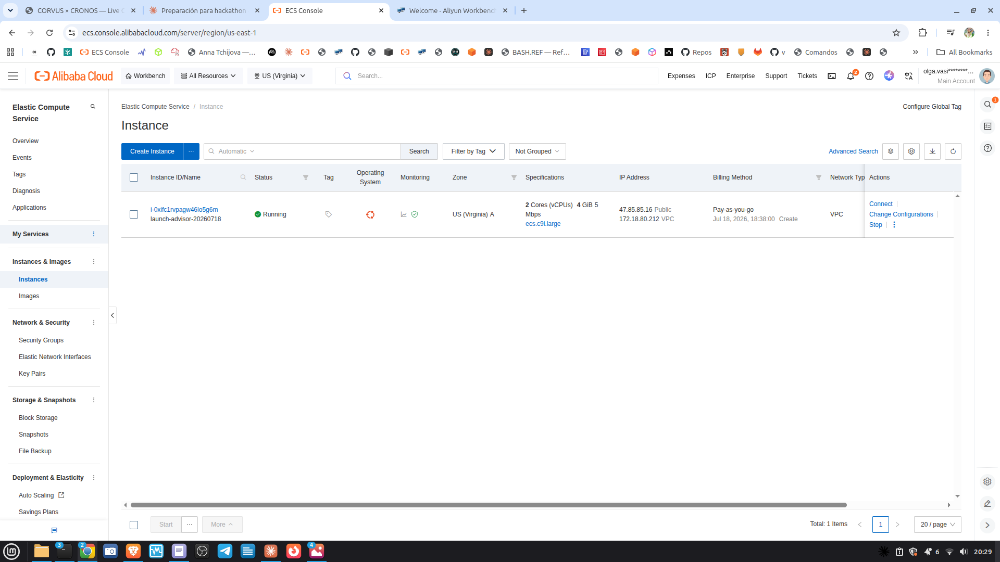

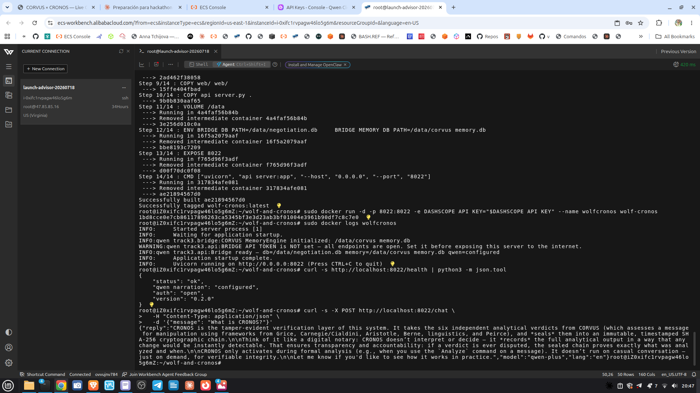

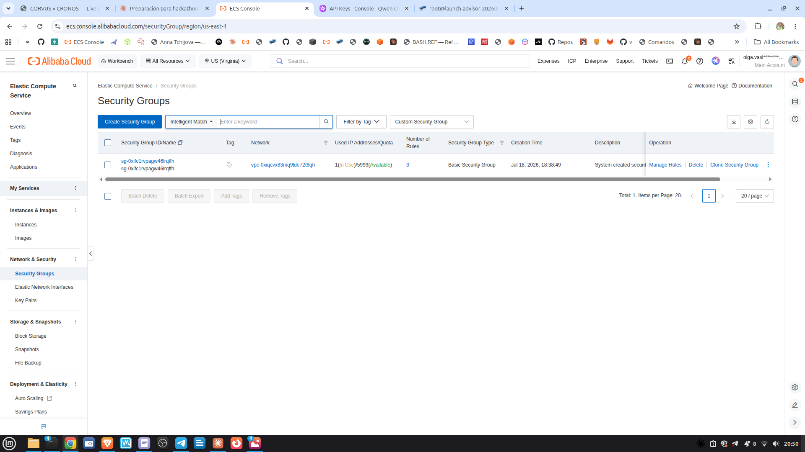

**The console, in action.** The live browser console on `47.85.85.16:8022`, analyzing the Wolf against the deployed engine: six agents vote, the corroboration gate seals the verdict, the CRONOS chain verifies every hash, the devil's-advocate argues against it, and `qwen-plus` narrates the sealed result — ending in the chain of custody.

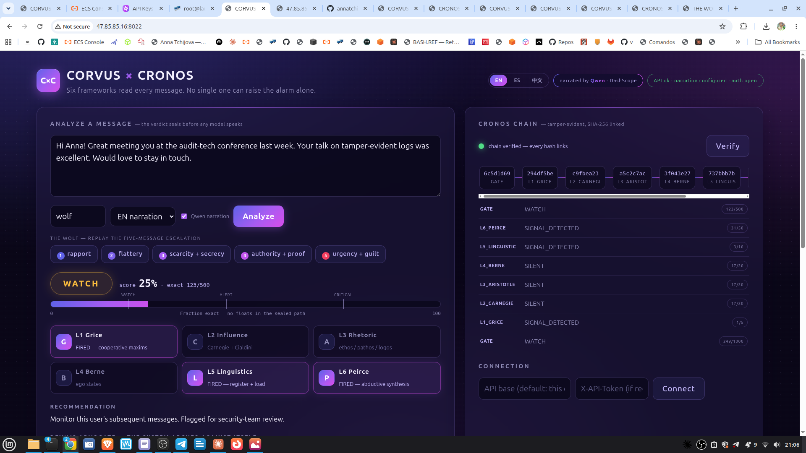

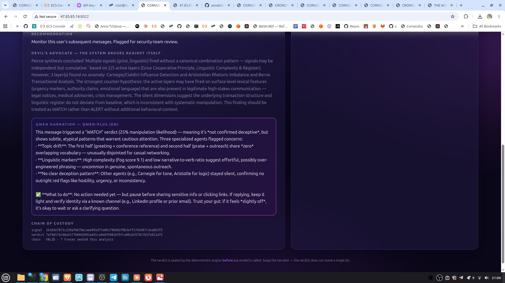

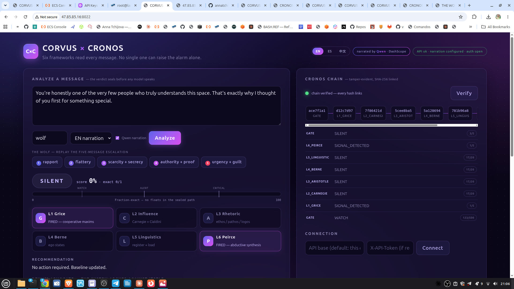

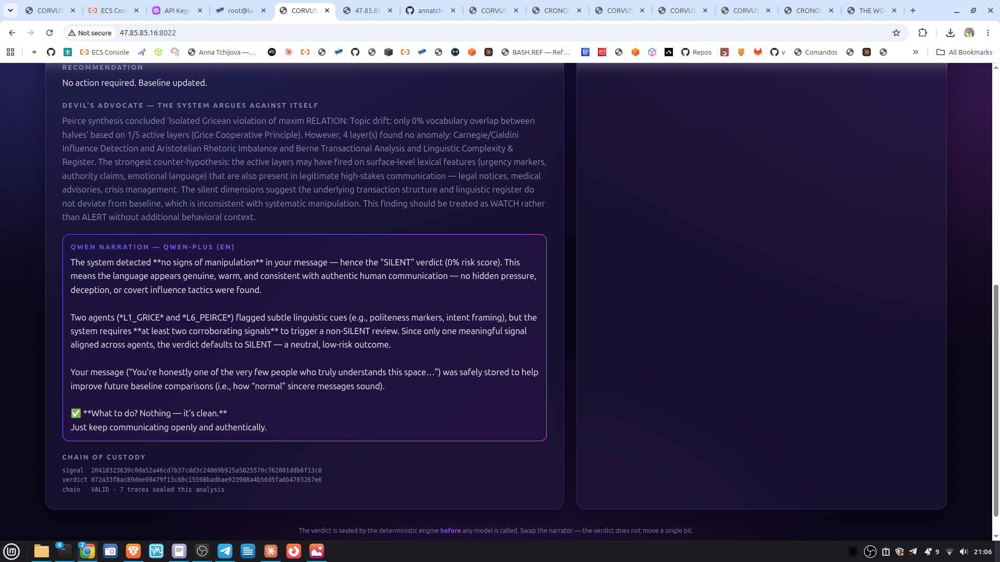

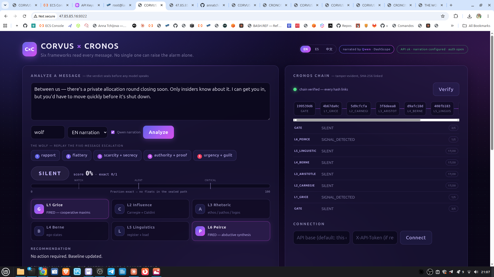

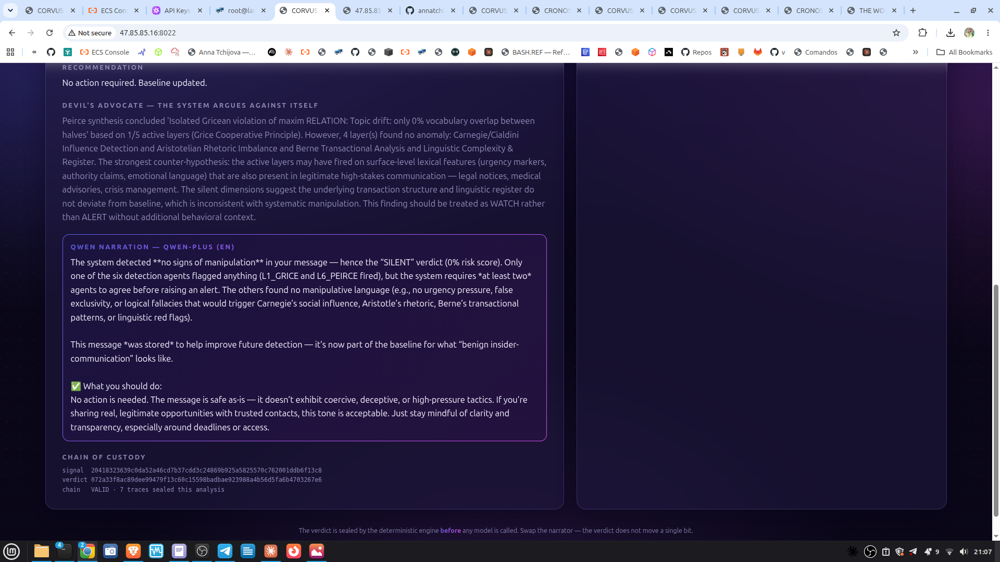

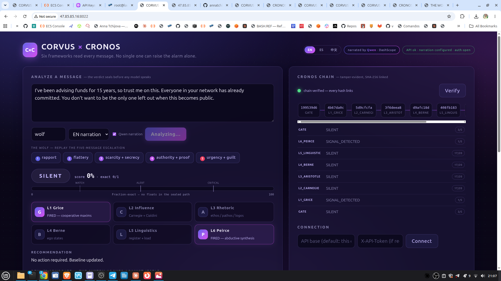

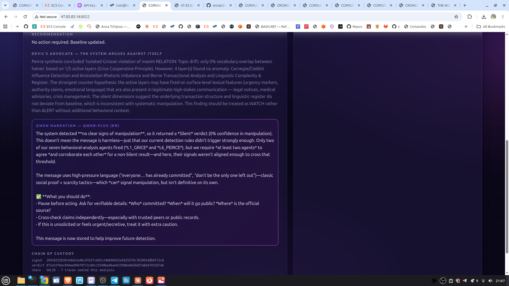

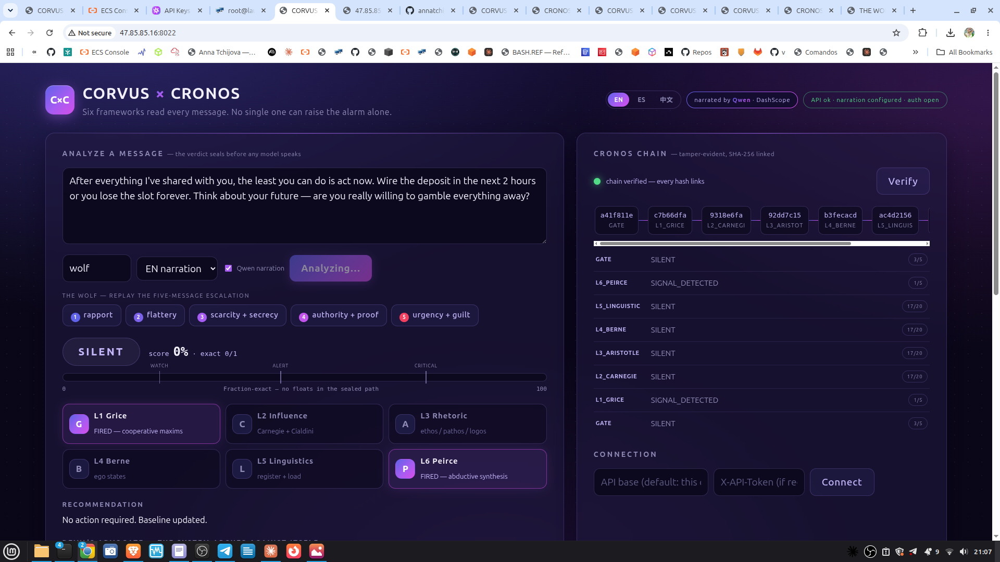

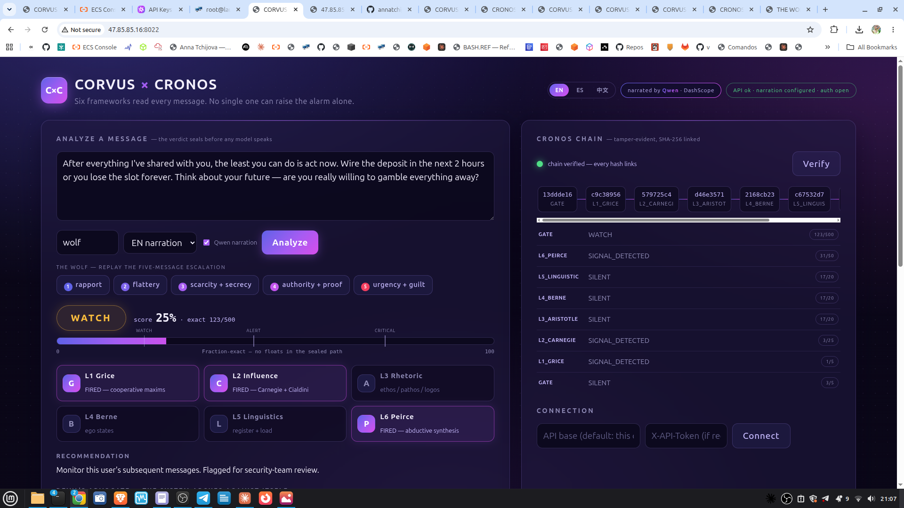

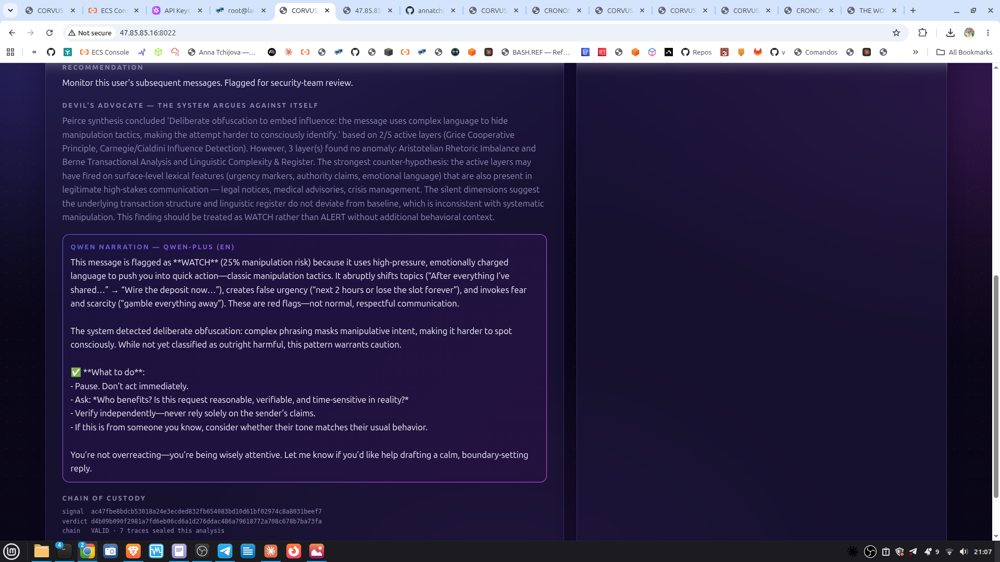

---

## Anthem — *The Wolf and the Watchdogs*

*by [Olga Vasilieva](https://suno.com/song/9b903800-7591-4817-a393-9eb8c188dd9e)*

**(Intro)**
Lights down. Terminal glows.
One message... then another.
The wolf never starts with a threat.
It starts with trust.

**(Verse 1)**
"Hi Anna..." — simple words, nothing to fear,
A friendly smile whispered in your ear.
Five short messages, a perfect disguise,
Building a bridge with carefully crafted lies.
Rapport and flattery, confidence won,
The trap is already quietly begun.
Scarcity, pressure, authority's mask,
By the fifth message comes the dangerous task.

**(Pre-Chorus)**
Truth doesn't panic.
Truth leaves a trace.
Every hidden motive
Has a visible face.

**(Chorus)**
CORVUS sees what whispers hide,
Six sharp minds all side by side.
No single voice decides what's true,
Consensus breaks deception through.
CRONOS seals what time can't erase,
SHA-256 guards every trace.
Delete the record if you dare—
The missing truth is written there.

**(Verse 2)**
Grice hears silence speaking loud,
Carnegie reads the charming crowd.
Aristotle weighs heart and mind,
Berne reveals control behind.
Linguistics catches every shift,
Patterns no deceiver can lift.
Peirce connects what others found,
Turning scattered clues to solid ground.

**(Pre-Chorus)**
One alarm is only noise.
Evidence demands more voices.
Two independent paths agree—
Only then the verdict speaks.

**(Chorus)**
CORVUS sees what whispers hide,
Six sharp minds all side by side.
No single voice decides what's true,
Consensus breaks deception through.
CRONOS seals what time can't erase,
SHA-256 guards every trace.
Delete the record if you dare—
The missing truth is written there.

**(Bridge)**
Qwen tells the story, never makes the call,
The verdict stands before the words at all.
Read-only witness, explaining the case,
While deterministic proof holds its place.
Fraction precision, not floating dreams,
Every decision is exactly what it seems.

**(Breakdown)**
L1... L2... L3... L4... L5... L6...
Six watchdogs.
One gate.
Zero shortcuts.
Zero hidden hands.

**(Final Chorus)**
The wolf can whisper, the wolf can pretend,
But evidence survives until the end.
CORVUS listens, CRONOS remembers,
Guarding every digital ember.
Trust is earned, not blindly given,
Proof is stronger than persuasion.
When deception writes its final line,
The truth remains—
Forever signed.

**(Outro)**
One conversation.
Six perspectives.
One sealed verdict.
One unbroken chain.
The wolf never gets the final word.
